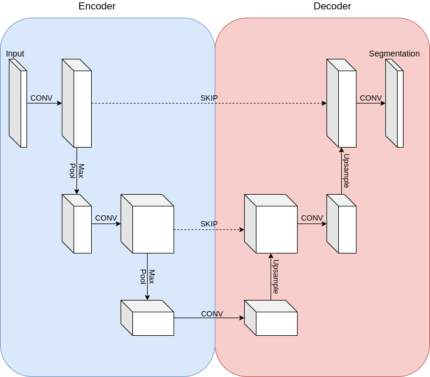

# Model
1. UNET (Ronnenverger et al. Miccai 2015) was used.
2. Encoder-Decoder architecture with skip connections
- Encoder reduces the feature maps by using convolutions + max pooling
- Decoder reconstructs segmentation mask by using upsampling+convolutions
- Skip-connections allows information flow from encoder to decoder

## Details
- Optimizer: Adam(lr=1e-4)
- Dice loss: $$ L(\hat{y}, y) = 1-\frac{2 |\hat{y} \cap y|}{|\hat{y}| + |y|}$$
- sigmoid activation commonly used with dice loss:
Threshold @ 0.5 --> preds > 0.5 is Atrium, else not atrium
- Train for 75 epochs